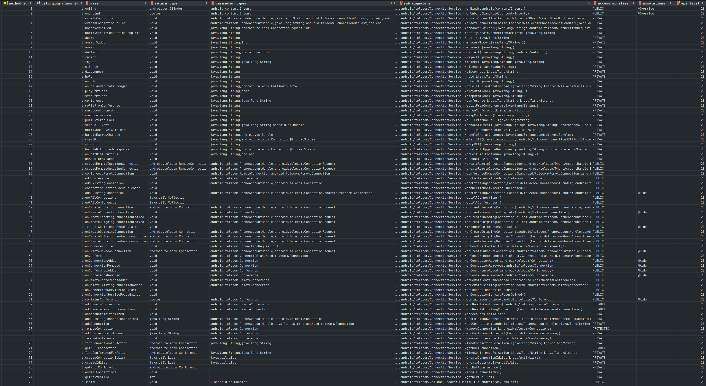

# RQ1

## About Data Collection and Preprocessing

### Extracting JARs

JAR files are stored in `android-<API-level>/raw/android.jar` files. We use `JAR-Extractor` to obtain APIs in it. Simply run the `Main` class in the `JAR-Extractor` working directory, to generate the corresponding `android-<API-level>/android.jar.txt` files. They are already in this repository.

### Extracting TXTs

We write the parser as the Python script `currenttxt_signature_converter.py`. Simply run this script to generate `current.txt.txt` files, which are converted API lists in the `current.txt` files.


### Counting CSV Synthesized APIs

We use heuristic to identify and filter CSV synthesized APIs (comes from anonymous classes or lambda expressions). Their statistics were taken by the `api_info.py` script, in the `analyzeCsvSynthesizedApis()` function.

Example run:

```bash
$ python .\api_info.py
in android-28, 134170 in total, 46(0.000342848624878885) synthesized from java, 70742 valid fields, 63361 valid methods
in android-29, 389084 in total, 37539(0.09648045152203637) synthesized from java, 144518 valid fields, 205333 valid methods
in android-30, 428360 in total, 42555(0.09934400971145765) synthesized from java, 155610 valid fields, 228343 valid methods
in android-31, 495713 in total, 52144(0.10518989818705582) synthesized from java, 179158 valid fields, 262447 valid methods
in android-32, 499653 in total, 52806(0.10568534562986713) synthesized from java, 180796 valid fields, 264074 valid methods
in android-33, 537521 in total, 60432(0.1124272354010355) synthesized from java, 193357 valid fields, 281872 valid methods
---
for java:
micro average: 0.09882145348301329, macro average: 0.08657829817938856
```


## About Finding 1

### Print table of all APIs

Run the `api_info.py` script's function `displayTable4()`, and print all API counts in LaTeX table format.

Example run:

```bash
$ python ./api_info.py
\texttt{pie-release} & 28 & 4,332 & 4,332 & 4,330 & 10,465 & 22,395 & 22,395 & 22,389 & 70,742 & 44,014 & 35,144 & 38,772 & 63,361 \\
\texttt{android10-release} & 29 & 4,530 & 4,526 & 4,526 & 20,013 & 23,396 & 23,396 & 23,396 & 144,518\upgreenarrow & 46,242 & 36,931 & 40,389 & 205,333\upgreenarrow \\
\texttt{android11-release} & 30 & 4,746 & 4,831 & 4,742 & 22,407 & 25,144 & 25,175 & 25,144 & 155,610 & 48,101 & 38,888 & 41,988 & 228,343 \\
\texttt{android12-release} & 31 & 5,069 & 5,127 & 3,133\downredarrow & 26,661 & 26,492 & 26,512 & 20,254\downredarrow & 179,158 & 50,508 & 40,578 & 27,635\downredarrow & 262,447 \\
\texttt{android12L-release} & 32 & 5,075 & 5,133 & 3,139 & 26,847 & 26,545 & 26,565 & 20,307 & 180,796 & 50,550 & 40,603 & 27,662 & 264,074 \\
\texttt{android13-release} & 33 & 5,276 & 5,334 & 3,197 & 28,906 & 27,868 & 27,888 & 20,669 & 193,357 & 52,716 & 42,371 & 28,178 & 281,872 \\
```

### Print table of removed APIs in TXT

Run the function `drawPairwiseTxtAddRemovedTable()`, print pairwise API differences in consecutive versions. Only apply to the TXT lists. You can modify the code for analyzing other lists as you wish.

Example run (should un-comment the function in the `api_info.py` file):

```bash
$ python .\api_info.py
~~~~28~\ding{213}~29 & 196 & 0 & 1,028 & 21 & 2,009 & 392 \\
~~~~29~\ding{213}~30 & 216 & 0 & 1,756 & 8 & 1,599 & 0 \\
~~~~30~\ding{213}~31 & 198 & 1,807 & 1,150 & 6,040 & 1,335 & 15,688 \\
~~~~31~\ding{213}~32 & 6 & 0 & 53 & 0 & 27 & 0 \\
~~~~32~\ding{213}~33 & 128 & 70 & 980 & 618 & 1,085 & 569 \\
```

### Dump the details of removed APIs in TXT

Run the function `analyzeTxt31Decrease()`, which print the statistics of removed APIs in TXT at API-level 31. It will also dump the removed classes into the `removed_classes_31.txt` file, which is already given in this folder.

Example run (should un-comment the function in the `api_info.py` file):

```bash
$ python .\api_info.py
6038/6040 fields from removed classes
15682/15688 methods from removed_classes
--------------------------------------------------------------------------------
write to removed_classes_31.txt file
--------------------------------------------------------------------------------
```


## About Finding 2

The source code related to Finding 2 are in the `analyze_removed_api.py` script. By running the `dumpRemovedApis()` function with specific ranges (should in consecutive versions), we can obtain all removed APIs. The folder already provides the following files of removed APIs:

+ `r_csv_28_29.txt`: removed classes, fields, methods in CSV, removed in API-level 29
+ `r_jar_28_29.txt`: removed classes, fields, methods in JAR, removed in API-level 29
+ `r_csv_29_30.txt`: removed classes, fields, methods in CSV, removed in API-level 30
+ and so on ...

With the `.txt` files, we can then check whether the corresponding APIs were actually removed. This is done by the `db_search()` function. We dump the AOSP database and extract API from the framework source code with [JavaParser](https://javaparser.org/). The database is not public, thus you may not run this function. However, we provide the searching results in the `.json` files.

Our API database looks like:



Taking the `removed_apis/r_txt_32_33.json` file as an example, in which the data be like:

```json
{
 "class": {
  "none": [],
  "removed": [
   "Landroid/app/usage/NetworkStats;",
   // totally 70 strings
  ],
  "annotate_remove": [],
  "deprecated": [],
  "hidden": [],
  "other": []
 },
 "field": {
  "none": [],
  "removed": [
   "Landroid/app/usage/NetworkStats$Bucket;->DEFAULT_NETWORK_ALL",
   // totally 618 strings
  ],
  "annotate_remove": [],
  "deprecated": [],
  "hidden": [],
  "other": []
 },
 "method": {
  "none": [
   "Landroid/app/usage/NetworkStatsManager$UsageCallback;-><init>()",
   // totally 18 strings
  ],
  "removed": [
   "Landroid/app/usage/NetworkStats;->close()",
   // totally 547 strings
  ],
  "annotate_remove": [
   "Landroid/webkit/WebChromeClient;->onReachedMaxAppCacheSize(JJLandroid/webkit/WebStorage$QuotaUpdater;)",
   // totally 4 strings
  ],
  "deprecated": [],
  "hidden": [],
  "other": []
 }
}
```

This shows the removed APIs in terms of classes, fields, and methods. In the JSON, there are 18 methods under `"none"`, which means either versions did not contain the API; 547 methods are `"removed"`, that are really removed; 4 are `"annotate_remove"`, which means they were only with a `@Removed` annotation.
