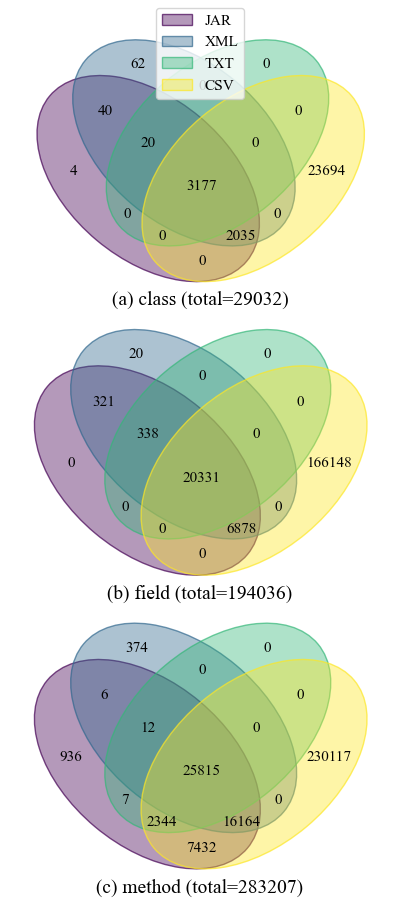

# RQ2

## Draw Venn4 Diagram

We draw Venn4 diagrams with `api_info.py`. It is like the one in the `rq1` folder, while only desired functions are included. Simply run the script to obtain all venn4 diagrams. The example diagram (API-level 33) used in the paper main content is as below:



It looks slightly different to the one that shown in our paper. This is because the draw function relies on an open-source module [pyvenn](https://github.com/LankyCyril/pyvenn). We made modification to it for better visual appearance. However, we cannot redistribute our modified source code to the pyvenn, as we have not use the GPLv3 license in our repository, which is the license adopted by pyvenn and doing so will violate the license term.

The large number of exclusive methods at API-level 28, as well as no shared fields or methods among the four AALs, is due to the fact that, under 28, the CSV list only contains non-public APIs.

## Other Findings

The findings in RQ2 are central to `analyze.py` script. If you want to analyze the versions other than 33, you can pass other API-level as command line arguments.

### Obtaining Finding 3

The can be run by executing the `analyze_class_intersection4()` function in the `analyze.py` script. Example run:

```bash
$ python .\analyze.py 31
{'android.*': 3089, 'org.apache.http.*': 13, 'javax.microedition.khronos.*': 11} total: 3113
all shared fields from shared classes
all shared methods from shared classes

$ python .\analyze.py 32
{'android.*': 3095, 'org.apache.http.*': 13, 'javax.microedition.khronos.*': 11} total: 3119
all shared fields from shared classes
all shared methods from shared classes

$ python .\analyze.py 33
{'android.*': 3153, 'org.apache.http.*': 13, 'javax.microedition.khronos.*': 11} total: 3177
all shared fields from shared classes
all shared methods from shared classes
```

### Obtaining Finding 4

We run `analyze_csv_exclusive()` to find out the proportion of exclusive CSV fields/methods that belong to the exclusive CSV classes. Example run:

```bash
$ python .\analyze.py 31
123121 (0.8030276348314973) fields from exclusive classes
188453 (0.8854126535176328) methods from non-exclusive classes

$ python .\analyze.py 33
134062 (0.8068830199581096) fields from exclusive classes
204467 (0.8885349626494349) methods from non-exclusive classes
```

To draw sample from exclusive CSV classes, we un-comment the sampling block in the `analyze_csv_exclusive()` function. By running the function, we obtained the 379 sample classes in the `sample-379.xlsx` file. Then we manually tagged the sample, and obtained the `sample-379-labels.xlsx` file. After our authors discussion, we automated the final categorization process, which is the `analyze_csv_sampling()` function. The final output is:

```
{'hide': 74, 'remove': 2, 'access': 17, 'internal': 58, 'aidl': 90, 'proto': 16, 'hpp': 8, 'sysprop': 1, 'repackaged-jdk': 32, 'repackaged-other': 81}
```

### Obtaining Finding 5

Finding 5 concerns the exclusive APIs in XML and JAR. To analyze the former, we run the function `analyze_xml_exclusive()`, which outputs:

```
{'test': 62}
--------------------------------------------------------------------------------
20 fields from exclusive classes
--------------------------------------------------------------------------------
374 methods from non-exclusive classes
```

Which indicates, for XML, all the 20 exclusive fields and all the 374 exclusive methods are from the 62 test-related classes. This output is consistent among API-levels at 31, 32, and 33. As for 30, the output is:

```
{'test': 60}
--------------------------------------------------------------------------------
18 fields from exclusive classes
--------------------------------------------------------------------------------
367 methods from non-exclusive classes
```

While for API-levels 28 and 29, there were no exclusive XML APIs (see the Venn diagrams), thus there is no output.

As for the JAR list, we use the `analyze_jar_class_method_exclusive()` function. Example run:

```bash
$ python .\analyze.py 33
{'android.annotation.NonNull', 'android.annotation.Nullable', 'androidx.annotation.RecentlyNullable', 'androidx.annotation.RecentlyNonNull'}
--------------------------------------------------------------------------------
MethodSub(class_name='android.graphics.RecordingCanvas', name='drawARGB', parameter_types=('int', 'int', 'int', 'int'))
MethodSub(class_name='android.graphics.RecordingCanvas', name='drawArc', parameter_types=('android.graphics.RectF', 'float', 'float', 'boolean', 'android.graphics.Paint'))
MethodSub(class_name='android.graphics.RecordingCanvas', name='drawArc', parameter_types=('float', 'float', 'float', 'float', 'float', 'float', 'boolean', 'android.graphics.Paint'))
MethodSub(class_name='android.graphics.RecordingCanvas', name='drawBitmap', parameter_types=('android.graphics.Bitmap', 'android.graphics.Matrix', 'android.graphics.Paint'))
MethodSub(class_name='android.graphics.RecordingCanvas', name='drawBitmap', parameter_types=('android.graphics.Bitmap', 'android.graphics.Rect', 'android.graphics.Rect', 'android.graphics.Paint'))
MethodSub(class_name='android.graphics.RecordingCanvas', name='drawBitmap', parameter_types=('android.graphics.Bitmap', 'android.graphics.Rect', 'android.graphics.RectF', 'android.graphics.Paint'))
MethodSub(class_name='android.graphics.RecordingCanvas', name='drawBitmap', parameter_types=('android.graphics.Bitmap', 'float', 'float', 'android.graphics.Paint'))
MethodSub(class_name='android.graphics.RecordingCanvas', name='drawBitmap', parameter_types=('int[]', 'int', 'int', 'float', 'float', 'int', 'int', 'boolean', 'android.graphics.Paint'))
MethodSub(class_name='android.graphics.RecordingCanvas', name='drawBitmap', parameter_types=('int[]', 'int', 'int', 'int', 'int', 'int', 'int', 'boolean', 'android.graphics.Paint'))
MethodSub(class_name='android.graphics.RecordingCanvas', name='drawBitmapMesh', parameter_types=('android.graphics.Bitmap', 'int', 'int', 'float[]', 'int', 'int[]', 'int', 'android.graphics.Paint'))
MethodSub(class_name='android.graphics.RecordingCanvas', name='drawCircle', parameter_types=('float', 'float', 'float', 'android.graphics.Paint'))
MethodSub(class_name='android.graphics.RecordingCanvas', name='drawColor', parameter_types=('int',))
MethodSub(class_name='android.graphics.RecordingCanvas', name='drawColor', parameter_types=('int', 'android.graphics.BlendMode'))
MethodSub(class_name='android.graphics.RecordingCanvas', name='drawColor', parameter_types=('int', 'android.graphics.PorterDuff$Mode'))
MethodSub(class_name='android.graphics.RecordingCanvas', name='drawColor', parameter_types=('long', 'android.graphics.BlendMode'))
MethodSub(class_name='android.graphics.RecordingCanvas', name='drawDoubleRoundRect', parameter_types=('android.graphics.RectF', 'float', 'float', 'android.graphics.RectF', 'float', 'float', 'android.graphics.Paint'))
MethodSub(class_name='android.graphics.RecordingCanvas', name='drawDoubleRoundRect', parameter_types=('android.graphics.RectF', 'float[]', 'android.graphics.RectF', 'float[]', 'android.graphics.Paint'))
MethodSub(class_name='android.graphics.RecordingCanvas', name='drawGlyphs', parameter_types=('int[]', 'int', 'float[]', 'int', 'int', 'android.graphics.fonts.Font', 'android.graphics.Paint'))
MethodSub(class_name='android.graphics.RecordingCanvas', name='drawLine', parameter_types=('float', 'float', 'float', 'float', 'android.graphics.Paint'))
MethodSub(class_name='android.graphics.RecordingCanvas', name='drawLines', parameter_types=('float[]', 'android.graphics.Paint'))
MethodSub(class_name='android.graphics.RecordingCanvas', name='drawLines', parameter_types=('float[]', 'int', 'int', 'android.graphics.Paint'))
MethodSub(class_name='android.graphics.RecordingCanvas', name='drawOval', parameter_types=('android.graphics.RectF', 'android.graphics.Paint'))
MethodSub(class_name='android.graphics.RecordingCanvas', name='drawOval', parameter_types=('float', 'float', 'float', 'float', 'android.graphics.Paint'))
MethodSub(class_name='android.graphics.RecordingCanvas', name='drawPaint', parameter_types=('android.graphics.Paint',))
MethodSub(class_name='android.graphics.RecordingCanvas', name='drawPath', parameter_types=('android.graphics.Path', 'android.graphics.Paint'))
MethodSub(class_name='android.graphics.RecordingCanvas', name='drawPicture', parameter_types=('android.graphics.Picture',))
MethodSub(class_name='android.graphics.RecordingCanvas', name='drawPicture', parameter_types=('android.graphics.Picture', 'android.graphics.Rect'))
MethodSub(class_name='android.graphics.RecordingCanvas', name='drawPicture', parameter_types=('android.graphics.Picture', 'android.graphics.RectF'))
MethodSub(class_name='android.graphics.RecordingCanvas', name='drawPoint', parameter_types=('float', 'float', 'android.graphics.Paint'))
MethodSub(class_name='android.graphics.RecordingCanvas', name='drawPoints', parameter_types=('float[]', 'android.graphics.Paint'))
MethodSub(class_name='android.graphics.RecordingCanvas', name='drawPoints', parameter_types=('float[]', 'int', 'int', 'android.graphics.Paint'))
MethodSub(class_name='android.graphics.RecordingCanvas', name='drawPosText', parameter_types=('char[]', 'int', 'int', 'float[]', 'android.graphics.Paint'))
MethodSub(class_name='android.graphics.RecordingCanvas', name='drawPosText', parameter_types=('java.lang.String', 'float[]', 'android.graphics.Paint'))
MethodSub(class_name='android.graphics.RecordingCanvas', name='drawRGB', parameter_types=('int', 'int', 'int'))
MethodSub(class_name='android.graphics.RecordingCanvas', name='drawRect', parameter_types=('android.graphics.Rect', 'android.graphics.Paint'))
MethodSub(class_name='android.graphics.RecordingCanvas', name='drawRect', parameter_types=('android.graphics.RectF', 'android.graphics.Paint'))
MethodSub(class_name='android.graphics.RecordingCanvas', name='drawRect', parameter_types=('float', 'float', 'float', 'float', 'android.graphics.Paint'))
MethodSub(class_name='android.graphics.RecordingCanvas', name='drawRoundRect', parameter_types=('android.graphics.RectF', 'float', 'float', 'android.graphics.Paint'))
MethodSub(class_name='android.graphics.RecordingCanvas', name='drawRoundRect', parameter_types=('float', 'float', 'float', 'float', 'float', 'float', 'android.graphics.Paint'))
MethodSub(class_name='android.graphics.RecordingCanvas', name='drawText', parameter_types=('char[]', 'int', 'int', 'float', 'float', 'android.graphics.Paint'))
MethodSub(class_name='android.graphics.RecordingCanvas', name='drawText', parameter_types=('java.lang.CharSequence', 'int', 'int', 'float', 'float', 'android.graphics.Paint'))
MethodSub(class_name='android.graphics.RecordingCanvas', name='drawText', parameter_types=('java.lang.String', 'float', 'float', 'android.graphics.Paint'))
MethodSub(class_name='android.graphics.RecordingCanvas', name='drawText', parameter_types=('java.lang.String', 'int', 'int', 'float', 'float', 'android.graphics.Paint'))
MethodSub(class_name='android.graphics.RecordingCanvas', name='drawTextOnPath', parameter_types=('char[]', 'int', 'int', 'android.graphics.Path', 'float', 'float', 'android.graphics.Paint'))
MethodSub(class_name='android.graphics.RecordingCanvas', name='drawTextOnPath', parameter_types=('java.lang.String', 'android.graphics.Path', 'float', 'float', 'android.graphics.Paint'))
MethodSub(class_name='android.graphics.RecordingCanvas', name='drawTextRun', parameter_types=('android.graphics.text.MeasuredText', 'int', 'int', 'int', 'int', 'float', 'float', 'boolean', 'android.graphics.Paint'))
MethodSub(class_name='android.graphics.RecordingCanvas', name='drawTextRun', parameter_types=('char[]', 'int', 'int', 'int', 'int', 'float', 'float', 'boolean', 'android.graphics.Paint'))
MethodSub(class_name='android.graphics.RecordingCanvas', name='drawTextRun', parameter_types=('java.lang.CharSequence', 'int', 'int', 'int', 'int', 'float', 'float', 'boolean', 'android.graphics.Paint'))
MethodSub(class_name='android.graphics.RecordingCanvas', name='drawVertices', parameter_types=('android.graphics.Canvas$VertexMode', 'int', 'float[]', 'int', 'float[]', 'int', 'int[]', 'int', 'short[]', 'int', 'int', 'android.graphics.Paint'))
MethodSub(class_name='android.icu.util.CopticCalendar', name='handleComputeMonthStart', parameter_types=('int', 'int', 'boolean'))
MethodSub(class_name='android.icu.util.CopticCalendar', name='handleGetLimit', parameter_types=('int', 'int'))
MethodSub(class_name='android.icu.util.EthiopicCalendar', name='handleComputeMonthStart', parameter_types=('int', 'int', 'boolean'))
MethodSub(class_name='android.inputmethodservice.AbstractInputMethodService', name='getSystemService', parameter_types=('java.lang.String',))
MethodSub(class_name='android.inputmethodservice.AbstractInputMethodService', name='onDestroy', parameter_types=())
MethodSub(class_name='android.inputmethodservice.InputMethodService', name='getSystemService', parameter_types=('java.lang.String',))
MethodSub(class_name='android.net.eap.EapSessionConfig$EapAkaConfig', name='equals', parameter_types=('java.lang.Object',))
MethodSub(class_name='android.net.eap.EapSessionConfig$EapAkaConfig', name='hashCode', parameter_types=())
MethodSub(class_name='android.net.eap.EapSessionConfig$EapSimConfig', name='equals', parameter_types=('java.lang.Object',))
MethodSub(class_name='android.net.eap.EapSessionConfig$EapSimConfig', name='hashCode', parameter_types=())
MethodSub(class_name='android.telephony.ims.feature.MmTelFeature$MmTelCapabilities', name='equals', parameter_types=('java.lang.Object',))
MethodSub(class_name='android.telephony.ims.feature.MmTelFeature$MmTelCapabilities', name='hashCode', parameter_types=())
MethodSub(class_name='android.text.SpannedString', name='toString', parameter_types=())
MethodSub(class_name='java.util.concurrent.ConcurrentHashMap$KeySetView', name='clear', parameter_types=())
MethodSub(class_name='java.util.concurrent.ConcurrentHashMap$KeySetView', name='containsAll', parameter_types=('java.util.Collection',))
MethodSub(class_name='java.util.concurrent.ConcurrentHashMap$KeySetView', name='isEmpty', parameter_types=())
MethodSub(class_name='java.util.concurrent.ConcurrentHashMap$KeySetView', name='retainAll', parameter_types=('java.util.Collection',))
MethodSub(class_name='java.util.concurrent.ConcurrentHashMap$KeySetView', name='size', parameter_types=())
MethodSub(class_name='java.util.concurrent.ConcurrentHashMap$KeySetView', name='toArray', parameter_types=())
MethodSub(class_name='java.util.concurrent.ConcurrentHashMap$KeySetView', name='toArray', parameter_types=('java.lang.Object[]',))
MethodSub(class_name='java.util.concurrent.ConcurrentHashMap$KeySetView', name='toString', parameter_types=())
70 exclusive methods
--------------------------------------------------------------------------------
default <init> count in JAR: 838
other <init> count in JAR: 28
(all <init> are default constructors)
```

It shows that 4 annotation classes are exclusive to JAR. Further details about the exclusive methods are manually checked.

### Obtaining Finding 6

The non-CSV APIs can be obtained by running the three functions: `analyze_non_csv_classes()`, `analyze_non_csv_fields()`, and `analyze_non_csv_methods()`.
