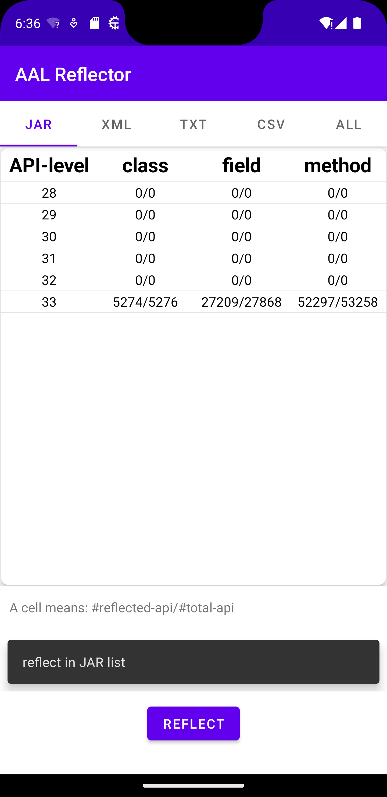

# RQ3

## About AAL-Reflector

AAL-Reflector is an Android app that display which APIs can be reflected on an Android device. It enables Java reflection on Android with the [FreeReflection](https://github.com/tiann/FreeReflection) library. We already provide a built [app](app-debug.apk) in this folder.

The app reflects the corresponding AALs in the device's system Android version, below is a screenshot running on an Android 13 (API-level 33) virtual device, which is a stock Android system.

It will also save the reflected APIs into the app's local directory. To reflect non-AAL APIs, use the "ALL" tab, and follow the below instruction.

## About Device Files

We have 9 devices, correspond to 9 folders:

1. android-30_redmi_note10
2. android-30_samsung_a50s
3. android-30_virtual_stock
4. android-31_redmi_10X
5. android-31_vivo_Y33s
6. android-31_virtual_stock
7. android-33_redmi_note12
8. android-33_samsung_a53
9. android-33_virtual_stock

